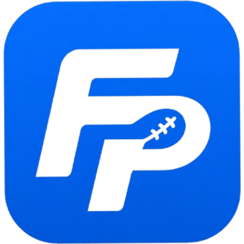

<p align="center">
  
</p>

<h1 align="center">Family Pickem</h1>

<p align="center">
  A Django-based NFL pick'em platform for running a private league: weekly picks, live scoring,
  standings, and season-long statistics.
</p>

<p align="center">
  <a href="https://github.com/jimdaga/family-pickem/actions/workflows/pull-request-tests.yaml"></a>
  <a href="https://github.com/jimdaga/family-pickem/actions/workflows/publish-artifacts.yaml"></a>
</p>

---

## Overview

Family Pickem runs a multi-family, multi-season NFL pick'em league. Users authenticate with
Google, submit weekly picks against a synced NFL schedule, and track results through standings,
per-user statistics, and a league message board. A superadmin console provides cross-family
operator tooling — job scheduling, audit logging, settings management — on top of the player-facing
site.

The backend is a standard Django + Django REST Framework application backed by PostgreSQL. Game
data, scores, and odds are synced on a schedule from ESPN via APScheduler-driven jobs. The frontend
is server-rendered Django templates styled with Tailwind CSS.

## Architecture

| Component | Responsibility |
|---|---|
| `pickem_api` | Core data models, DRF serializers/viewsets, and the cron jobs that sync scores, odds, and standings from external NFL data sources |
| `pickem_homepage` | Player-facing views, forms, templates, and static assets (picks, standings, stats, message board) |
| `pickem_superadmin` | Superuser-only operator console — pool/family/team administration, job queueing, audit log, banners |
| `pickem` | Project settings, root URL routing, and shared utilities (season resolution, context processors) |

Scheduled work (game syncs, standings recomputation, one-off admin jobs) runs through APScheduler
against a Django-backed job store rather than as ad hoc scripts, so the same pipeline serves both
automated cron behavior and on-demand jobs queued from the superadmin console.

## Getting Started

### Requirements

- Python 3.11+
- PostgreSQL 15
- Node.js (for the Tailwind build)
- Google OAuth client credentials

### Setup

```bash
git clone https://github.com/jimdaga/family-pickem.git
cd family-pickem

python -m venv venv
source venv/bin/activate

cd pickem
pip install -r requirements.txt
```

Configure environment variables (see [Configuration](#configuration)), then:

```bash
python manage.py migrate
python manage.py createsuperuser
python manage.py runserver
```

Build the Tailwind stylesheet from the repo root:

```bash
npm install
npm run build:css      # watch mode
npm run build:prod     # minified, for commit
```

The app is served at `http://localhost:8000`.

### Docker

```bash
docker-compose up --build
```

This starts PostgreSQL and the Django app together, reading configuration from `.env.app`.

## Configuration

Core settings are provided via environment variables; see `pickem/pickem/settings.py` for the full
list. Notable ones:

| Variable | Purpose |
|---|---|
| `SECRET_KEY` | Django secret key |
| `DATABASE_URL` | PostgreSQL connection string |
| `GOOGLE_OAUTH2_KEY` / `GOOGLE_OAUTH2_SECRET` | Google OAuth credentials |
| `DEBUG` | Enable/disable debug mode |
| `DJANGO_ALLOWED_HOSTS` / `CSRF_TRUSTED_ORIGINS` | Host and CSRF allowlists |
| `AWS_STORAGE_BUCKET_NAME` | S3 bucket for static/media files in production |

**Sideline**, the league's AI recap persona, and its OpenAI integration are configured at runtime
through **Super Admin → Sideline**, not environment variables — a saved database setting always
takes precedence. Environment variables for that feature exist only as a bootstrap fallback prior
to first configuration.

## Development

```bash
cd pickem
python manage.py test              # run the test suite
python manage.py makemigrations    # after model changes
python manage.py shell             # Django shell
```

Custom management commands: `createsu` (scripted superuser creation), `manage_banners`
(site-wide banner management).

Cron scripts can also be run manually against a target environment:

```bash
cd pickem/pickem_api
python cron_update_games_v2.py --url localhost
python cron_update_picks.py --url localhost
python cron_update_standings.py --url localhost
```

## Deployment

Production and dev environments run on Kubernetes via ArgoCD, driven entirely by GitOps:

- **Dev** deploys automatically on every push to `main`.
- **Production** deploys automatically when a GitHub Release is published.

Helm charts live in `charts/family-pickem`; environment-specific values are in
`infra/app/values-{prd,dev}.yaml`. Secrets are managed through External Secrets Operator against
AWS Secrets Manager — Kubernetes secrets are never edited directly.

## Contributing

1. Create a feature branch off `main`
2. Make your changes, with tests where applicable
3. Open a pull request — CI runs the test suite automatically

---

<p align="center"><sub>Built for a family and friends NFL pick'em league.</sub></p>
